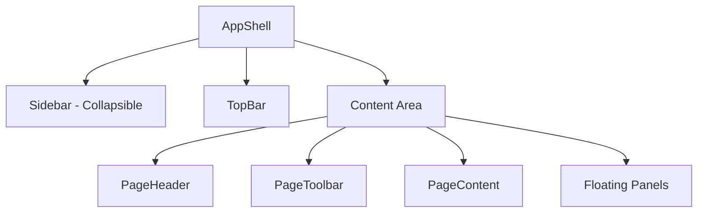

# Apple HIG Refactoring Plan - Lofi Frontend

## Executive Summary

This document outlines a comprehensive refactoring plan to align the Lofi frontend application with Apple Human Interface Guidelines (HIG) principles, applying the pattern to **ALL modules** in the application.

**All Modules to Refactor:**
- Products, Branches, Roles, Users, Permissions, Notifications, Loans

---

## Complete Module List with Page Types

### Management Modules

| Module | List Page | Create Page | Detail Page |
|--------|-----------|-------------|-------------|
| Products | ✅ Product List | ✅ Product Form | **Product Detail** |
| Branches | ✅ Branch List | ✅ Branch Form | **Branch Detail** |
| Roles | ✅ Role List | ✅ Role Form | **Role Detail** |
| Users | ✅ User List | ✅ User Form | **User Detail** |
| Permissions | ✅ Permission List | ✅ Permission Form | **Permission Detail** |
| Notifications | ✅ Notification List | ❌ N/A | **Notification Detail** |
| Loan Review | ✅ Queue List | ❌ N/A | **Loan Detail (mode=review)** |
| Loan Approval | ✅ Queue List | ❌ N/A | **Loan Detail (mode=approval)** |
| Disbursements | ✅ Queue List | ❌ N/A | **Loan Detail (mode=disburse)** |

---

## Phase 1: Global Layout Structure Refactor

### 1.1 App Shell Architecture



### 1.2 Layout Refactor Tasks

#### Sidebar Component (`src/app/core/layouts/sidebar/`)

**Changes Required:**

| File | Change |
|------|--------|
| `sidebar.component.ts` | Add collapsible state, badge support, active item tracking |
| `sidebar.component.html` | Restructure for collapsible nav, add badge placeholders |
| `sidebar.component.css` | Add collapse animations, Apple HIG active states |

**Apple HIG Active State:**
```css
.active-link {
  @apply bg-gray-100 text-gray-900 font-medium;
  border-left: 3px solid #3b82f6;
}
```

**Badge Counter Style:**
```css
.nav-badge {
  @apply flex items-center justify-center min-w-[20px] h-[20px] px-1 
         bg-red-500 text-white text-[10px] font-bold rounded-full;
}
```

---

## Phase 2: Shared Component Library

### 2.1 Component Structure

```
src/app/shared/components/
├── page/
│   ├── page-header.component.ts
│   └── page-toolbar.component.ts
├── card/
│   ├── card.component.ts
│   ├── card-header.component.ts
│   └── card-footer.component.ts
├── table/
│   ├── card-table.component.ts
│   ├── table-header.component.ts
│   └── table-row.component.ts
├── search/
│   └── search-input.component.ts
├── sorting/
│   └── sort-dropdown.component.ts
├── pagination/
│   └── pagination.component.ts
├── status/
│   ├── status-badge.component.ts
│   └── workflow-stepper.component.ts
├── timeline/
│   └── activity-timeline.component.ts
├── form/
│   ├── text-area.component.ts
│   └── comment-box.component.ts
├── actions/
│   └── action-buttons.component.ts
└── map/
    └── leaflet-map.component.ts
```

---

## Phase 3: Page Patterns

### 3.1 List Page Pattern (All Modules)

**Used by:** Product List, Branch List, Role List, User List, Permission List, Notification List, All Queues

```html
<app-page-header 
  [title]="moduleTitle"
  [subtitle]="moduleSubtitle">
</app-page-header>

<app-page-toolbar>
  <app-search-input 
    placeholder="Search..."
    (search)="onSearch($event)">
  </app-search-input>
  
  <app-sort-dropdown 
    [options]="sortOptions"
    (sortChange)="onSort($event)">
  </app-sort-dropdown>
  
  <app-filter-button 
    *ngIf="hasFilters"
    [filters]="filterOptions"
    (filterChange)="onFilter($event)">
  </app-filter-button>
  
  <app-primary-cta 
    *ngIf="hasCreate"
    label="Create New"
    icon="pi-plus"
    (click)="navigateToCreate()">
  </app-primary-cta>
</app-page-toolbar>

<app-card-table>
  <app-table-header [columns]="columns"></app-table-header>
  <app-table-row *ngFor="let item of items" [data]="item">
    <ng-container *ngTemplateOutlet="rowActions; context: { item: item }">
    </ng-container>
  </app-table-row>
  <app-pagination [total]="total" (pageChange)="onPageChange($event)"></app-pagination>
</app-card-table>
```

### 3.2 Detail Page Pattern (All Modules)

**Used by:** Product Detail, Branch Detail, Role Detail, User Detail, Permission Detail, Notification Detail, Loan Detail

```html
<app-page-header 
  [title]="entityTitle"
  [subtitle]="entitySubtitle">
  <ng-container actions>
    <app-button variant="secondary" label="Edit" icon="pi-pencil"></app-button>
  </ng-container>
</app-page-header>

<div class="grid grid-cols-1 lg:grid-cols-3 gap-8">
  <!-- Left Column - Primary Content -->
  <div class="lg:col-span-2 space-y-6">
    <app-card title="Overview">
      <!-- Key information -->
    </app-card>
    
    <app-card *ngIf="hasDocuments" title="Documents">
      <!-- Document list -->
    </app-card>
    
    <app-card *ngIf="hasTimeline" title="Activity History">
      <app-activity-timeline [events]="activityEvents"></app-activity-timeline>
    </app-card>
  </div>
  
  <!-- Right Column - Actions & Meta -->
  <div class="lg:col-span-1 space-y-6">
    <app-card title="Details">
      <!-- Metadata -->
    </app-card>
    
    <app-card *ngIf="hasWorkflow">
      <app-workflow-stepper [steps]="workflowSteps"></app-workflow-stepper>
    </app-card>
    
    <app-card *ngIf="hasLocation">
      <app-location-map [lat]="lat" [lng]="lng" [address]="address"></app-location-map>
    </app-card>
    
    <app-card *ngIf="hasActions">
      <app-action-buttons 
        [actions]="availableActions"
        (action)="handleAction($event)">
      </app-action-buttons>
    </app-card>
  </div>
</div>
```

---

## Phase 4: Module-Specific Detail Pages

### 4.1 Product Detail Page

```typescript
interface ProductDetailData {
  id: string;
  name: string;
  description: string;
  loanType: string;
  minAmount: number;
  maxAmount: number;
  minTenor: number;
  maxTenor: number;
  interestRate: number;
  status: 'ACTIVE' | 'INACTIVE';
  createdAt: Date;
  updatedAt: Date;
  createdBy: string;
}
```

### 4.2 Branch Detail Page

```typescript
interface BranchDetailData {
  id: string;
  name: string;
  code: string;
  address: string;
  city: string;
  phone: string;
  email: string;
  manager: string;
  status: 'ACTIVE' | 'INACTIVE';
  location?: { lat: number; lng: number };
}
```

### 4.3 Role Detail Page

```typescript
interface RoleDetailData {
  id: string;
  name: string;
  description: string;
  permissions: Permission[];
  usersCount: number;
  createdAt: Date;
  updatedAt: Date;
}
```

### 4.4 User Detail Page

```typescript
interface UserDetailData {
  id: string;
  username: string;
  email: string;
  fullName: string;
  phone: string;
  role: Role;
  branch?: Branch;
  status: 'ACTIVE' | 'INACTIVE';
  lastLogin?: Date;
  createdAt: Date;
}
```

### 4.5 Notification Detail Page

```typescript
interface NotificationDetailData {
  id: string;
  title: string;
  message: string;
  type: 'INFO' | 'WARNING' | 'ERROR' | 'SUCCESS';
  read: boolean;
  createdAt: Date;
  metadata?: Record<string, any>;
}
```

### 4.6 Loan Detail Page (Unified)

```typescript
interface LoanDetailData {
  id: string;
  customerName: string;
  customerEmail: string;
  customerPhone: string;
  productName: string;
  loanAmount: number;
  tenor: number;
  interestRate: number;
  purpose: string;
  status: 'DRAFT' | 'SUBMITTED' | 'REVIEWED' | 'APPROVED' | 'REJECTED' | 'DISBURSED' | 'COMPLETED';
  location?: { lat: number; lng: number; address: string };
  documents: Document[];
  timeline: TimelineEvent[];
  workflowSteps: WorkflowStep[];
}
```

---

## Phase 5: Detail Page Components

### 5.1 Workflow Stepper Component

For loan processing only:

```typescript
@Component({
  selector: 'app-workflow-stepper',
  template: `
    <div class="workflow-stepper">
      <div *ngFor="let step of steps; let i = index" class="step"
        [class.completed]="step.completed"
        [class.current]="step.current"
        [class.pending]="!step.completed && !step.current">
        <div class="step-indicator">
          <i *ngIf="step.completed" class="pi pi-check"></i>
          <span *ngIf="!step.completed">{{ i + 1 }}</span>
        </div>
        <div class="step-content">
          <span class="step-label">{{ step.label }}</span>
          <span class="step-date">{{ step.date | date:'medium' }}</span>
          <span class="step-by">by {{ step.by }}</span>
        </div>
      </div>
    </div>
  `
})
export class WorkflowStepperComponent {
  @Input() steps: WorkflowStep[] = [];
}
```

### 5.2 Activity Timeline Component

For all modules:

```typescript
@Component({
  selector: 'app-activity-timeline',
  template: `
    <div class="activity-timeline">
      <div *ngFor="let event of events" class="timeline-item">
        <div class="timeline-dot"></div>
        <div class="timeline-line"></div>
        <div class="timeline-content">
          <span class="timeline-title">{{ event.title }}</span>
          <span class="timeline-time">{{ event.timestamp | date:'MMM d, h:mm a' }}</span>
          <p class="timeline-description">{{ event.description }}</p>
          <span class="timeline-actor">by {{ event.actor }}</span>
        </div>
      </div>
    </div>
  `
})
export class ActivityTimelineComponent {
  @Input() events: TimelineEvent[] = [];
}
```

### 5.3 Action Buttons Component

```typescript
@Component({
  selector: 'app-action-buttons',
  template: `
    <div class="action-buttons flex flex-col gap-3">
      <button *ngIf="canApprove" class="btn-primary" (click)="approve()">
        <i class="pi pi-check mr-2"></i>Approve
      </button>
      <button *ngIf="canReject" class="btn-destructive" (click)="reject()">
        <i class="pi pi-times mr-2"></i>Reject
      </button>
      <button *ngIf="canDisburse" class="btn-primary" (click)="disburse()">
        <i class="pi pi-money-bill mr-2"></i>Disburse
      </button>
      <button *ngIf="canEdit" class="btn-secondary" (click)="edit()">
        <i class="pi pi-pencil mr-2"></i>Edit
      </button>
    </div>
  `
})
export class ActionButtonsComponent {
  @Input() canApprove: boolean = false;
  @Input() canReject: boolean = false;
  @Input() canDisburse: boolean = false;
  @Input() canEdit: boolean = false;
  @Output() action = new EventEmitter<string>();
}
```

---

## Phase 6: Button Routing Rules

### Queue to Detail Navigation

| Action | From | To | Mode |
|--------|------|-----|------|
| View | Product List | Product Detail | `view` |
| Edit | Product Detail | Product Form | `edit` |
| View | Branch List | Branch Detail | `view` |
| Edit | Branch Detail | Branch Form | `edit` |
| View | Role List | Role Detail | `view` |
| Edit | Role Detail | Role Form | `edit` |
| View | User List | User Detail | `view` |
| Edit | User Detail | User Form | `edit` |
| Review | Loan Review Queue | Loan Detail | `review` |
| Approve | Approval Queue | Loan Detail | `approval` |
| Disburse | Disbursement Queue | Loan Detail | `disburse` |

---

## Phase 7: Implementation Priority

### Priority 1: Foundation
- [ ] Create shared component library structure
- [ ] Create Page Header component
- [ ] Create Page Toolbar component
- [ ] Create Card Table component
- [ ] Create Status Badge component

### Priority 2: List Page Standardization
- [ ] Create Search Input component
- [ ] Create Sort Dropdown component
- [ ] Create Pagination component
- [ ] Refactor Product List page
- [ ] Refactor Branch List page
- [ ] Refactor Role List page
- [ ] Refactor User List page

### Priority 3: Detail Pages - Management Modules
- [ ] Create Activity Timeline component
- [ ] Refactor Product Detail page
- [ ] Create Branch Detail page
- [ ] Create Role Detail page
- [ ] Create User Detail page
- [ ] Create Permission Detail page
- [ ] Create Notification Detail page

### Priority 4: Detail Pages - Loan Modules
- [ ] Create Workflow Stepper component
- [ ] Create Action Buttons component
- [ ] Create Comment Box component
- [ ] Refactor Loan Detail page with mode support
- [ ] Implement routing with mode parameters

### Priority 5: Polish
- [ ] Create Empty State component
- [ ] Update all form pages
- [ ] Add loading states
- [ ] Add error states
- [ ] Update CSS for Apple HIG consistency

---

## Apple HIG Styling Summary

| Property | Value |
|----------|-------|
| Border Radius | 12px |
| Background | #F5F5F7 |
| Card Background | White |
| Primary Color | #3b82f6 |
| Shadows | Soft, no hard borders |
| One Primary CTA | Per screen |
| Modal | Only for confirmations |

---

## Decision Rules

| Rule | Implementation |
|------|----------------|
| List pages for selection | ✅ All modules |
| Detail pages for viewing/editing | ✅ All modules |
| Create pages as full forms | ✅ No modals |
| Action buttons on detail | ✅ Contextual |
| Workflow status visible | ✅ Loan detail |
| Timeline for all modules | ✅ Activity tracking |
