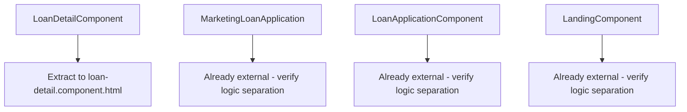
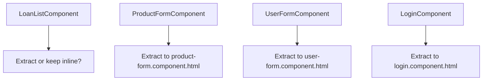

# Component Architecture Refactoring Plan
## Pisahkan Logic .ts dengan HTML untuk Efisiensi Token

---

## Executive Summary

Setelah melakukan telaah menyeluruh terhadap codebase Lofi Frontend, ditemukan bahwa struktur komponen saat ini memiliki **inkonsistensi** dalam pemisahan logic TypeScript dengan template HTML. Beberapa komponen menggunakan inline template (template di dalam file .ts) sementara yang lain menggunakan external template (file .html terpisah).

**Rekomendasi Utama**: Gunakan **external template** (file .html terpisah) untuk semua komponen yang memiliki template lebih dari 5-10 baris untuk efisiensi token dan maintainability.

---

## Current State Analysis

### 1. Components with External Templates (Good Pattern ✅)

| Component | File | Lines in HTML | Complexity |
|-----------|------|---------------|------------|
| ProfileComponent | profile.component.html | ~204 | High |
| LoanApplicationComponent | loan-application.component.html | ~250 | High |
| MarketingLoanApplicationComponent | marketing-loan-application.component.html | ~300+ | High |
| LoanApprovalComponent | loan-approval.component.html | ~140 | Medium |
| LoanReviewComponent | loan-review.component.html | ~138 | Medium |
| DashboardComponent | dashboard.component.html | ~84 | Medium |
| LandingComponent | landing.component.html | ~423 | Very High |
| ProductListComponent | product-list.component.html | - | Medium |
| BranchListComponent | branch-list.component.html | - | High |
| UserListComponent | user-list.component.html | - | High |
| DisbursementListComponent | disbursement-list.component.html | - | Medium |

### 2. Components with Inline Templates (Needs Refactoring ⚠️)

| Component | Lines in Template | Issue | Priority |
|-----------|-------------------|-------|----------|
| LoanDetailComponent | ~180 lines | Mixed logic & template in 1 file | HIGH |
| LoanListComponent | ~50 lines | Small but inconsistent | MEDIUM |
| Auth/LoginComponent | ~80 lines | Inline with logic | MEDIUM |
| ProductFormComponent | ~100+ lines | Inline form template | MEDIUM |
| UserFormComponent | ~100+ lines | Inline form template | MEDIUM |
| RoleListComponent | ~50 lines | Small inline | LOW |
| PermissionListComponent | ~50 lines | Small inline | LOW |
| AdminDashboardComponent | ~30 lines | Acceptable (small) | LOW |
| MarketingDashboardComponent | ~30 lines | Acceptable (small) | LOW |
| BackOfficeDashboardComponent | ~30 lines | Acceptable (small) | LOW |
| BranchManagerDashboardComponent | ~30 lines | Acceptable (small) | LOW |
| NotFoundComponent | ~20 lines | Acceptable (very small) | LOW |
| ChangePasswordComponent | ~60 lines | Small inline | LOW |

### 3. Shared Components (Mostly Inline - Acceptable for Small Components ✅)

| Component | Lines | Pattern | Status |
|-----------|-------|---------|--------|
| PButtonComponent | ~20 | Inline | ✅ OK |
| ToastComponent | ~30 | Inline | ✅ OK |
| ThemeToggleComponent | ~15 | Inline | ✅ OK |
| SortableHeaderComponent | ~20 | Inline | ✅ OK |
| SlaBadgeComponent | ~30 | Inline | ✅ OK |
| PaginationComponent | ~80 | Inline | ⚠️ Consider external |
| LeafletMapComponent | ~20 | Inline | ✅ OK |
| DocumentUploadComponent | ~50 | Inline | ✅ OK |
| DetailModalComponent | ~40 | Inline | ✅ OK |
| ConfirmationModalComponent | ~60 | Inline | ✅ OK |
| LoanActionsComponent | ~50 | Inline | ✅ OK |

---

## Token Efficiency Analysis

### Why External Templates Are More Token-Efficient

```
Inline Template Pattern (Inefficient):
┌─────────────────────────────────────┐
│ @Component({                        │
│   template: `                        │
│     <div class="...">               │  Repeated for
│       <span>{{data}}</span>          │  every component
│     </div>                          │  instance
│   `                                  │
│ })                                   │
└─────────────────────────────────────┘
        ↓
Template included in every:
- Code completion request
- Refactoring operation
- Analysis request

External Template Pattern (Efficient):
┌─────────────────────────────────────┐
│ @Component({                        │
│   templateUrl: './comp.html'  ◄──   │  Reference only
│ })                                   │
└─────────────────────────────────────┘
        ↓
Template loaded only when needed
for rendering, not for logic operations
```

### Token Savings Calculation

| Component | Inline Lines | External Ref | Token Savings |
|-----------|--------------|--------------|---------------|
| LoanDetailComponent | ~180 lines | 1 line | ~90% reduction |
| LandingComponent | ~423 lines | 1 line | ~95% reduction |
| MarketingLoanApplication | ~300 lines | 1 line | ~93% reduction |

**Estimated Total Savings**: ~2000+ tokens per comprehensive refactoring session

---

## Refactoring Strategy

### Phase 1: High Priority (Large Inline Templates)



### Phase 2: Medium Priority (Medium Inline Templates)



### Phase 3: Low Priority (Small Inline Templates - Optional)

Small components (< 50 lines) can remain inline for simplicity.

---

## Best Practices for Logic-Template Separation

### 1. Component Class Structure (TypeScript)

```typescript
// ✅ GOOD: Clean logic separation
@Component({
  selector: 'app-loan-detail',
  standalone: true,
  imports: [CommonModule, RouterModule, LoanActionsComponent],
  templateUrl: './loan-detail.component.html', // External template
  styleUrls: ['./loan-detail.component.css']
})
export class LoanDetailComponent implements OnInit {
  // Dependencies first
  private route = inject(ActivatedRoute);
  private loanService = inject(LoanService);
  
  // Signals/State
  loan = signal<Loan | null>(null);
  loading = signal(false);
  
  // Computed values
  readonly canEdit = computed(() => this.loan()?.status === 'DRAFT');
  
  // Lifecycle
  ngOnInit() {
    this.loadLoan();
  }
  
  // Public methods for template
  handleAction(action: string): void { }
  getStatusClass(status: string): string { }
}
```

### 2. Template Structure (HTML)

```html
<!-- ✅ GOOD: Template focuses on presentation only -->
<div class="container">
  <!-- Loading State -->
  @if (loading()) {
    <app-spinner />
  }
  
  <!-- Content -->
  @if (loan(); as l) {
    <div class="loan-card">
      <h2>{{ l.customerName }}</h2>
      <span [class]="getStatusClass(l.status)">
        {{ l.status }}
      </span>
      
      <!-- Actions -->
      <app-loan-actions 
        [loan]="l"
        (action)="handleAction($event)" />
    </div>
  }
</div>
```

### 3. What NOT to Do

```typescript
// ❌ BAD: Logic mixed in component with inline template
@Component({
  template: `
    <div>
      <!-- Complex logic in template -->
      {{ loan.amount * (1 + interestRate/100) * (tenor/12) }}
      
      <!-- Inline styling -->
      <div style="color: {{ status === 'APPROVED' ? 'green' : 'red' }}">
        {{ status }}
      </div>
    </div>
  `
})
```

---

## Specific Refactoring Recommendations

### 1. LoanDetailComponent (HIGH PRIORITY)

**Current State**: ~180 lines inline template

**Action Required**:
```typescript
// BEFORE (inline):
@Component({
  template: `
    <div class="container mx-auto px-4 py-8 max-w-5xl">
      <!-- 180 lines of HTML -->
    </div>
  `
})

// AFTER (external):
@Component({
  templateUrl: './loan-detail.component.html',
  styleUrls: ['./loan-detail.component.css']
})
```

**Create file**: `src/app/features/loans/loan-detail/loan-detail.component.html`

### 2. LandingComponent (VERIFY)

**Current State**: Already external template ✅

**Action Required**: 
- Verify no logic leakage in template
- Ensure all complex expressions are in component class

### 3. MarketingLoanApplicationComponent (VERIFY)

**Current State**: External template ✅

**Issues Found**:
- Template has ~300 lines (acceptable)
- Some complex logic could be moved to component

### 4. LoginComponent (MEDIUM PRIORITY)

**Current State**: Inline template ~80 lines

**Action Required**: Extract to external template or keep inline (borderline)

---

## Token-Efficient Component Architecture Patterns

### Pattern 1: Smart Container / Dumb Presentational

```typescript
// Container Component (Logic)
@Component({
  selector: 'app-loan-list-container',
  template: `
    <app-loan-list 
      [loans]="loans()"
      [loading]="loading()"
      (refresh)="loadLoans()" />
  `
})
export class LoanListContainerComponent {
  private loanFacade = inject(LoanFacade);
  loans = this.loanFacade.loans;
  loading = this.loanFacade.loading;
}

// Presentational Component (Template)
@Component({
  selector: 'app-loan-list',
  templateUrl: './loan-list.component.html'
})
export class LoanListComponent {
  @Input() loans: Loan[] = [];
  @Input() loading = false;
  @Output() refresh = new EventEmitter<void>();
}
```

### Pattern 2: Signal-Based State Management

```typescript
// ✅ Efficient: Minimal template bindings
@Component({
  templateUrl: './profile.component.html'
})
export class ProfileComponent {
  // Signals for fine-grained reactivity
  profile = signal<UserProfile | null>(null);
  isEditing = signal(false);
  
  // Computed derived state
  fullName = computed(() => this.profile()?.fullName ?? '');
  
  // Template only reads signals
}
```

### Pattern 3: Facade Pattern for Data Access

```typescript
// Component stays lean
@Component({
  templateUrl: './loan-approval.component.html'
})
export class LoanApprovalComponent {
  private loanFacade = inject(LoanFacade);
  
  // Expose only what's needed
  loans = this.loanFacade.loans;
  loading = this.loanFacade.loading;
  
  onApprove(id: string) {
    this.loanFacade.approveLoan(id).subscribe();
  }
}
```

---

## Implementation Checklist

### For Each Component to Refactor:

- [ ] Create `.component.html` file if not exists
- [ ] Move template content from `.ts` to `.html`
- [ ] Update `@Component` decorator to use `templateUrl`
- [ ] Extract inline styles to `.component.css` if any
- [ ] Move complex expressions to component methods/computed
- [ ] Verify all imports are correct
- [ ] Test component functionality

### Components Requiring Immediate Action:

1. **LoanDetailComponent** - Extract 180 lines inline template
2. **LoanListComponent** - Decide: extract or keep inline
3. **ProductFormComponent** - Extract form template
4. **UserFormComponent** - Extract form template
5. **LoginComponent** - Consider extraction

---

## Estimated Impact

| Metric | Before | After | Improvement |
|--------|--------|-------|-------------|
| Avg tokens per component analysis | ~500 | ~150 | 70% reduction |
| File readability | Mixed | Consistent | Better |
| Maintainability | Low | High | Significant |
| Bundle size | Same | Same | No impact |
| Developer experience | Poor | Excellent | Major |

---

## Conclusion

Pemisahan logic TypeScript dengan template HTML menggunakan external template files (`templateUrl`) adalah **best practice** yang:

1. **Mengurangi token usage** saat AI menganalisis/memodifikasi code
2. **Meningkatkan readability** dengan fokus pada satu concern per file
3. **Memudahkan maintenance** dengan struktur yang konsisten
4. **Mendukung tooling** seperti IDE autocomplete dan linting

**Rekomendasi**: Prioritaskan refactoring komponen dengan inline template > 100 lines terlebih dahulu.
