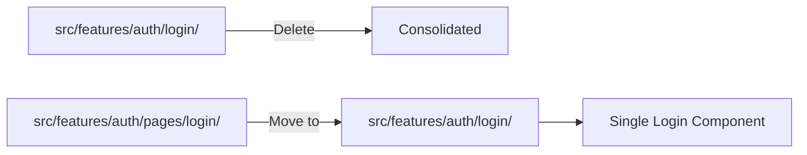
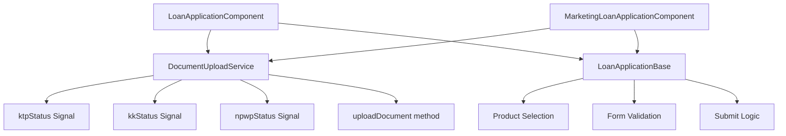

# Component Refactoring Plan: Eliminating Redundancies

## Executive Summary

This document outlines a comprehensive plan to identify and eliminate redundant components, services, and code duplication in the Lofi Frontend Angular application. The analysis reveals several areas where code consolidation will improve maintainability, reduce bundle size, and establish consistent patterns.

---

## 1. Redundant Profile Components

### Current State
Two profile components exist with overlapping functionality:

| Component | Location | Purpose | Complexity |
|-----------|----------|---------|------------|
| `ProfileComponent` | `src/app/features/profile/` | Full-featured profile with biodata, location map, photo upload | High |
| `ProfileComponent` | `src/app/features/users/profile/` | Basic profile with username/email only | Low |

### Issues
- **Duplicate selector**: Both use `app-profile` selector (will cause conflicts)
- **Route confusion**: `/profile` vs `/users/me` serve similar purposes
- **Feature disparity**: The basic version lacks password change functionality already available in `change-password.component.ts`

### Recommended Solution
**Consolidate to single ProfileComponent** in `src/app/features/profile/`

```mermaid
graph TD
    A[Current State] --> B[Remove src/app/features/users/profile/]
    B --> C[Enhance src/app/features/profile/]
    C --> D[Single Profile Component]
    
    E[Route Consolidation] --> F[/profile - Full Profile]
    E --> G[/settings/password - Password Change]
    E --> H[Remove /users/me route]
```

### Action Items
1. **Delete** `src/app/features/users/profile/` directory entirely
2. **Update** `src/app/features/users/users.routes.ts` - remove the `/me` route
3. **Keep** `src/app/features/profile/profile.component.ts` as the canonical profile
4. **Optional**: Add a read-only mode input to ProfileComponent for admin viewing other users

---

## 2. Redundant Login Components

### Current State
Two login implementations exist:

| Component | Location | Template Style | Usage |
|-----------|----------|----------------|-------|
| `LoginComponent` | `src/app/features/auth/login/` | External HTML template | Legacy route |
| `LoginComponent` | `src/app/features/auth/pages/login/` | Inline template | Currently active |

### Route Analysis
```typescript
// auth.routes.ts
{
  path: 'login',
  loadComponent: () => import('./login/login.component')  // Uses external template
}
```

The `pages/login` version appears to be a newer implementation with inline template and uses `PButtonComponent`.

### Recommended Solution
**Consolidate to single LoginComponent** using the inline template version



### Action Items
1. **Replace** `src/app/features/auth/login/login.component.ts` with content from `pages/login/login.component.ts`
2. **Delete** `src/app/features/auth/pages/` directory
3. **Update** `auth.routes.ts` to point to consolidated location
4. **Delete** unused CSS and HTML files from old login component

---

## 3. Duplicate AuthService

### Current State
Two AuthService implementations:

| Service | Location | Scope | State Management |
|---------|----------|-------|------------------|
| `AuthService` | `src/app/core/services/auth.service.ts` | Global | Signals + TokenStorage |
| `AuthService` | `src/app/features/auth/services/auth.service.ts` | Feature | Signals + localStorage |

### Key Differences
- **Core version**: Uses `TokenStorageService`, has `refreshToken()`, `fetchCurrentUser()`
- **Feature version**: Direct localStorage access, has `register()`, `logout()` with navigation

### Recommended Solution
**Merge into single AuthService** in `src/app/core/services/`

```typescript
// Consolidated AuthService should have:
- login(credentials): Observable<UserInfo>
- register(userData): Observable<any>
- logout(): void
- refreshToken(): Observable<AuthResponse>
- fetchCurrentUser(): Observable<UserInfo>
- currentUser: Signal<UserInfo | null>
- isAuthenticated: Computed<boolean>
```

### Action Items
1. **Merge** methods from feature AuthService into core AuthService
2. **Delete** `src/app/features/auth/services/` directory
3. **Update** all imports to use `src/app/core/services/auth.service`
4. **Ensure** TokenStorageService pattern is used consistently

---

## 4. Duplicate Loan Application Components

### Current State
Two loan application forms with significant code duplication:

| Component | Purpose | Document Upload | Location Features |
|-----------|---------|-----------------|-------------------|
| `LoanApplicationComponent` | Customer self-application | KTP, KK, NPWP | No |
| `MarketingLoanApplicationComponent` | Marketing on-behalf | KTP, KK, NPWP, Slip Gaji | Yes |

### Identified Duplications

#### A. Document Upload Logic (Exact Duplication)
Both components have identical `onFileSelected()` implementations:

```typescript
// Same pattern in both:
- Status signals: ktpStatus, kkStatus, npwpStatus
- Upload flow: pending → uploading → done
- Toast notifications
- Error handling
```

#### B. Product Selection
Both use:
```typescript
products = this.productFacade.products;
filteredProducts = computed(() => ...);
```

#### C. Form Structure
Both have loan amount, tenor, and product selection fields.

### Recommended Solution
**Extract shared functionality into composables/services**



### Action Items

#### Phase 1: Create DocumentUploadService
```typescript
// src/app/core/services/document-upload.service.ts
@Injectable({ providedIn: 'root' })
export class DocumentUploadService {
  private documentService = inject(DocumentService);
  private toast = inject(ToastService);

  // Status signals for each document type
  ktpStatus = signal<'pending' | 'uploading' | 'done'>('pending');
  kkStatus = signal<'pending' | 'uploading' | 'done'>('pending');
  npwpStatus = signal<'pending' | 'uploading' | 'done'>('pending');
  slipGajiStatus = signal<'pending' | 'uploading' | 'done'>('pending');

  uploadDocument(loanId: string, file: File, type: string): void {
    // Consolidated upload logic
  }

  get allDocumentsUploaded(): boolean {
    return this.ktpStatus() === 'done' && 
           this.kkStatus() === 'done' && 
           this.npwpStatus() === 'done';
  }
}
```

#### Phase 2: Create DocumentUploadComponent
Extract the document upload UI into a reusable component:

```typescript
// src/app/shared/components/document-upload/document-upload.component.ts
@Component({
  selector: 'app-document-upload',
  standalone: true,
  template: `
    @for (doc of documents; track doc.type) {
      <div class="document-item">
        <!-- Upload UI for each document type -->
      </div>
    }
  `
})
export class DocumentUploadComponent {
  @Input() loanId!: string;
  @Input() documents: DocumentConfig[] = [];
  @Output() allUploaded = new EventEmitter<boolean>();
}
```

#### Phase 3: Simplify Loan Application Components
After extraction, both components should be significantly smaller:

```typescript
// MarketingLoanApplicationComponent simplified
export class MarketingLoanApplicationComponent {
  private fb = inject(FormBuilder);
  private loanService = inject(LoanService);
  private documentUploadService = inject(DocumentUploadService); // NEW
  // ... other injections

  // Remove: ktpStatus, kkStatus, npwpStatus signals
  // Remove: onFileSelected() method
  // Keep: Marketing-specific form fields and validation
}
```

---

## 5. Additional Refactoring Opportunities

### A. ChangePasswordComponent Consolidation
The `change-password.component.ts` exists in `src/app/features/profile/` but the basic profile in `users/profile/` has its own password form. After consolidating profiles, ensure password change is only in one place.

### B. Shared UI Components
The `PButtonComponent` in `src/app/shared/ui/p-button/` should be used consistently. The `loan-application` component uses native buttons while `pages/login` uses `PButtonComponent`.

### C. Form Field Patterns
Many forms repeat the same input styling patterns. Consider creating form field components:
- `FormInputComponent`
- `FormSelectComponent`
- `FormTextareaComponent`

---

## Implementation Priority

| Priority | Item | Impact | Effort |
|----------|------|--------|--------|
| P0 | Consolidate Profile Components | High - Selector conflict | Low |
| P0 | Consolidate Login Components | High - Route confusion | Low |
| P1 | Consolidate AuthService | High - State inconsistency | Medium |
| P1 | Extract DocumentUploadService | Medium - Code duplication | Medium |
| P2 | Create DocumentUploadComponent | Medium - Reusability | Medium |
| P3 | Form Field Components | Low - Consistency | High |

---

## File Deletion Summary

The following files/directories should be **deleted** after consolidation:

```
src/app/features/users/profile/
  ├── profile.component.ts
  ├── profile.component.html
  └── profile.component.css

src/app/features/auth/pages/
  └── login/
      └── login.component.ts

src/app/features/auth/services/
  └── auth.service.ts

src/app/features/auth/login/
  ├── login.component.html (after merging inline template)
  └── login.component.css (after merging styles)
```

---

## Testing Considerations

After each consolidation:
1. Verify all routes still resolve correctly
2. Test authentication flow (login → profile → logout)
3. Test loan application with document upload
4. Verify marketing loan application with location features
5. Check that profile updates persist correctly

---

## Migration Checklist

- [ ] Profile consolidation complete
- [ ] Login consolidation complete
- [ ] AuthService consolidation complete
- [ ] DocumentUploadService created and tested
- [ ] All imports updated
- [ ] Routes verified working
- [ ] Unit tests passing
- [ ] E2E tests passing
