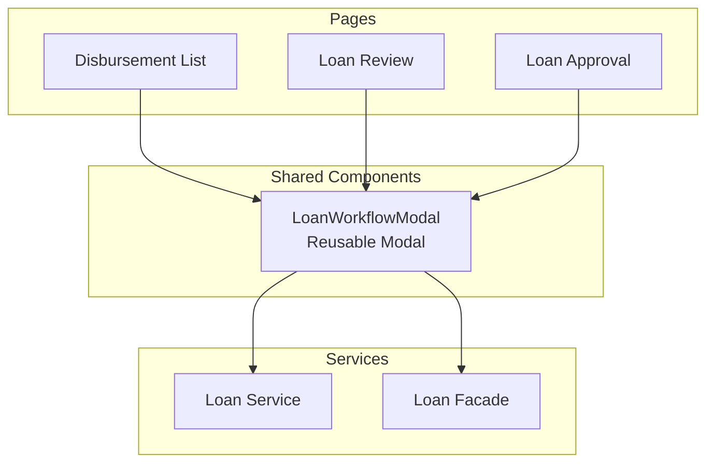
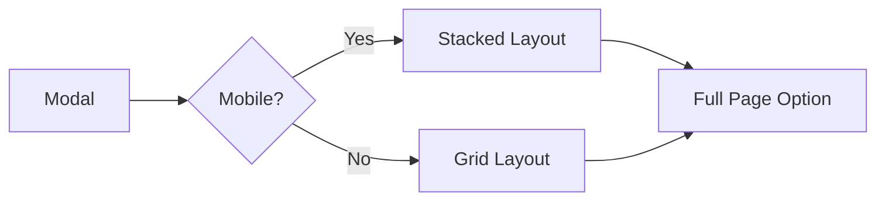

# Disbursement Workflow Modal Implementation Plan

## Overview
Implementasi modal reusable untuk menampilkan detail loan dengan step tracker (Submitted → Review → Approval → Disburse) yang akan digunakan di:
- `/dashboard/disbursements` - Disbursement List
- `/dashboard/loans/review` - Loan Review
- `/dashboard/loans/approval` - Loan Approval

## Architecture



## Component Structure

```
src/app/shared/components/
└── loan-workflow-modal/
    ├── loan-workflow-modal.component.ts      # Main component
    ├── loan-workflow-modal.component.html      # Template
    └── loan-workflow-modal.component.css       # Styles
```

## Data Models

```typescript
// Loan Workflow Step Interface
export interface LoanWorkflowStep {
    step: 'SUBMITTED' | 'REVIEW' | 'APPROVAL' | 'DISBURSE';
    status: 'completed' | 'current' | 'pending';
    timestamp?: string;      // ISO Date string
    userName?: string;       // User who performed action
    notes?: string;          // Notes/comments from action
    icon?: string;           // Optional custom icon
}

// Loan Detail Interface
export interface LoanDetailInfo {
    id: string;
    customerName: string;
    customerPhone?: string;
    productName: string;
    amount: number;
    tenor: number;
    interestRate?: number;
    adminFee?: number;
    purpose?: string;
    status: string;
    currentStage: string;
    bankName?: string;
    accountNumber?: string;
    accountHolderName?: string;
    disbursementReference?: string;
}

// Modal Input/Output
export interface LoanWorkflowModalInput {
    loanId: string;
    loanDetail: LoanDetailInfo;
    workflowSteps: LoanWorkflowStep[];
    availableActions: string[];  // ['REVIEW', 'APPROVE', 'DISBURSE']
}

export interface LoanWorkflowModalOutput {
    action: { type: string; notes?: string };
    close: void;
}
```

## Step Tracker Design

### Visual Layout
```
┌─────────────────────────────────────────────────────────────┐
│  LOAN WORKFLOW - #LOAN-001                                  │
├─────────────────────────────────────────────────────────────┤
│  CUSTOMER INFO              │  LOAN DETAILS                 │
│  ─────────────────────────  │  ─────────────────────────    │
│  Name: John Doe             │  Product: Personal Loan      │
│  Phone: +62812345678        │  Amount: Rp 10.000.000        │
│                             │  Tenure: 12 months           │
│                             │  Interest: 12%               │
├─────────────────────────────────────────────────────────────┤
│  WORKFLOW STATUS                                            │
│  ─────────────────────────────────────────────────────────  │
│                                                             │
│    ┌───┐      ┌───┐      ┌───┐      ┌───┐                │
│    │ ✓ │ ───▶ │ ✓ │ ───▶ │ ✓ │ ───▶ │   │                │
│    └───┘      └───┘      └───┘      └───┘                │
│   SUBMITTED   REVIEW    APPROVAL   DISBURSE              │
│                                                             │
│   Jan 15, 2025     Jan 16, 2025    Jan 17, 2025           │
│   10:30 AM         09:15 AM        02:45 PM               │
│   by Admin         by Reviewer     by Manager             │
│                                                             │
├─────────────────────────────────────────────────────────────┤
│  ACTIONS                                                    │
│  ─────────────────────────────────────────────────────────  │
│  [Review Loan]  [Approve Loan]  [Disburse Loan]  [Close]  │
└─────────────────────────────────────────────────────────────┘
```

### Step Status Colors
| Status | Color | Meaning |
|--------|-------|---------|
| Completed | Green (#10B981) | Step finished successfully |
| Current | Blue (#3B82F6) | Active/current step |
| Pending | Gray (#9CA3AF) | Future step |

## Implementation Steps

### Step 1: Create Loan Workflow Modal Component
**File**: `src/app/shared/components/loan-workflow-modal/loan-workflow-modal.component.ts`

```typescript
@Component({
    selector: 'app-loan-workflow-modal',
    standalone: true,
    imports: [CommonModule, FormsModule, ActivityTimelineComponent],
    templateUrl: './loan-workflow-modal.component.html',
    styleUrls: ['./loan-workflow-modal.component.css']
})
export class LoanWorkflowModalComponent {
    @Input() isOpen = false;
    @Input() loanDetail!: LoanDetailInfo;
    @Input() workflowSteps: LoanWorkflowStep[] = [];
    @Input() availableActions: string[] = [];
    
    @Output() onAction = new EventEmitter<{type: string; notes?: string}>();
    @Output() onClose = new EventEmitter<void>();
    
    actionNotes = '';
    
    // Helper methods
    getStepStatus(step: string): 'completed' | 'current' | 'pending' { ... }
    canPerformAction(action: string): boolean { ... }
    executeAction(type: string): void { ... }
}
```

### Step 2: Create Modal Template
**File**: `src/app/shared/components/loan-workflow-modal/loan-workflow-modal.component.html`

Key sections:
1. Modal overlay and container
2. Loan detail info grid (2 columns)
3. Step tracker horizontal layout
4. Activity timeline for step details
5. Action buttons section

### Step 3: Add Modal Styles
**File**: `src/app/shared/components/loan-workflow-modal/loan-workflow-modal.component.css`

```css
.modal-overlay {
    @apply fixed inset-0 bg-black/50 z-50 flex items-center justify-center p-4;
}

.modal-content {
    @apply bg-white rounded-xl shadow-xl max-w-4xl w-full max-h-[90vh] overflow-hidden;
}

.step-tracker {
    @apply flex items-center justify-between gap-2 py-4;
}

.step-item {
    @apply flex flex-col items-center flex-1;
}

.step-connector {
    @apply flex-1 h-0.5 bg-gray-200;
}
```

### Step 4: Extend Loan Service
**File**: `src/app/core/services/loan.service.ts`

Add method to fetch loan workflow history:
```typescript
getLoanWorkflowHistory(loanId: string): Observable<LoanWorkflowStep[]> {
    return this.http.get<ApiResponse<any>>(`${this.baseUrl}/${loanId}/workflow-history`).pipe(
        map(res => res.data)
    );
}
```

### Step 5: Update Disbursement List Component
**File**: `src/app/features/disbursements/disbursement-list/disbursement-list.component.ts`

Integrate the modal:
```typescript
import { LoanWorkflowModalComponent } from '../../../shared/components/loan-workflow-modal/loan-workflow-modal.component';

@Component({
    imports: [..., LoanWorkflowModalComponent]
})
export class DisbursementComponent {
    // Add modal state
    workflowModal = signal({
        isOpen: false,
        loanId: '',
        loanDetail: null,
        workflowSteps: [],
        availableActions: ['DISBURSE']
    });
    
    onViewDetails(loan: any): void {
        this.loanFacade.getLoanWorkflow(loan.id).subscribe(steps => {
            this.workflowModal.set({
                isOpen: true,
                loanId: loan.id,
                loanDetail: loan,
                workflowSteps: steps,
                availableActions: ['DISBURSE']
            });
        });
    }
}
```

### Step 6: Update Loan Review Component
**File**: `src/app/features/loans/loan-review/loan-review.component.ts`

Add modal integration for review action.

### Step 7: Update Loan Approval Component
**File**: `src/app/features/loans/loan-approval/loan-approval.component.ts`

Add modal integration for approval action.

## Responsive Design

For mobile/limited space, modal will:
1. Scroll vertically within max-height constraint
2. Stack loan detail sections vertically
3. Use compact step tracker with tooltips
4. Option to expand to full-screen page via button



## File Changes Summary

| File | Action | Description |
|------|--------|-------------|
| `shared/components/loan-workflow-modal/loan-workflow-modal.component.ts` | Create | Main modal component |
| `shared/components/loan-workflow-modal/loan-workflow-modal.component.html` | Create | Modal template |
| `shared/components/loan-workflow-modal/loan-workflow-modal.component.css` | Create | Modal styles |
| `core/services/loan.service.ts` | Modify | Add `getLoanWorkflowHistory` method |
| `disbursement-list/disbursement-list.component.ts` | Modify | Integrate modal |
| `disbursement-list/disbursement-list.component.html` | Modify | Add modal markup |
| `loans/loan-review/loan-review.component.ts` | Modify | Integrate modal |
| `loans/loan-approval/loan-approval.component.ts` | Modify | Integrate modal |

## Dependencies
- Angular 18+ (standalone components)
- Tailwind CSS (already in project)
- PrimeIcons (already in project)
- CommonModule, FormsModule

## Next Steps
1. Review and approve this plan
2. Switch to Code mode to implement
3. Test each integration point
4. Verify responsive behavior
