# Implementation Roadmap
## Pisahkan Logic .ts dengan HTML - Action Plan

---

## Ringkasan Eksekutif

Berdasarkan telaah menyeluruh terhadap codebase Lofi Frontend, berikut adalah daftar komponen yang perlu direfactor untuk mencapai efisiensi token optimal dan maintainability yang lebih baik.

---

## Priority Matrix

```mermaid
graph TD
    subgraph HIGH_PRIORITY["🔴 HIGH PRIORITY"]
        A1[LoanDetailComponent<br/>~180 lines inline]
        A2[MarketingLoanApplication<br/>Verify logic separation]
        A3[LoanApplicationComponent<br/>Verify logic separation]
    end
    
    subgraph MEDIUM_PRIORITY["🟡 MEDIUM PRIORITY"]
        B1[ProductFormComponent<br/>~100 lines inline]
        B2[UserFormComponent<br/>~100 lines inline]
        B3[LoginComponent<br/>~80 lines inline]
        B4[LoanListComponent<br/>~50 lines inline]
    end
    
    subgraph LOW_PRIORITY["🟢 LOW PRIORITY"]
        C1[Dashboard Components<br/>~30 lines each]
        C2[Shared Components<br/>Already optimized]
    end
    
    subgraph NO_ACTION["✅ NO ACTION NEEDED"]
        D1[ProfileComponent<br/>Already external]
        D2[LandingComponent<br/>Already external]
        D3[LoanApprovalComponent<br/>Already external]
    end
```



---

## Phase 1: High Priority Components

### 1. LoanDetailComponent

**Status**: 🔴 CRITICAL - 180 lines inline template

**Files to Modify**:
- `src/app/features/loans/loan-detail/loan-detail.component.ts`
- Create: `src/app/features/loans/loan-detail/loan-detail.component.html`
- Create: `src/app/features/loans/loan-detail/loan-detail.component.css`

**Action Items**:
```markdown
1. Extract inline template (~180 lines) to external HTML file
2. Extract inline styles to external CSS file
3. Update @Component decorator:
   - Change: `template: \`...\`` 
   - To: `templateUrl: './loan-detail.component.html'`
   - Add: `styleUrls: ['./loan-detail.component.css']`
4. Verify all imports are correct
5. Test component functionality
```

**Token Savings**: ~70% reduction per analysis

---

### 2. MarketingLoanApplicationComponent

**Status**: 🟡 VERIFY - Already external but check logic leakage

**Files to Check**:
- `src/app/features/loans/marketing-loan-application/marketing-loan-application.component.ts`
- `src/app/features/loans/marketing-loan-application/marketing-loan-application.component.html`

**Action Items**:
```markdown
1. Verify no complex logic in template
2. Move any inline calculations to component methods
3. Ensure all event handlers are in .ts file
4. Check for inline style bindings that could be computed properties
```

---

### 3. LoanApplicationComponent

**Status**: 🟡 VERIFY - Already external but check logic leakage

**Files to Check**:
- `src/app/features/loans/loan-application/loan-application.component.ts`
- `src/app/features/loans/loan-application/loan-application.component.html`

**Action Items**:
```markdown
1. Verify template only contains presentation logic
2. Move complex expressions to computed signals
3. Ensure form validation logic is in .ts file
```

---

## Phase 2: Medium Priority Components

### 4. ProductFormComponent

**Status**: 🟡 MEDIUM - ~100 lines inline template

**Files**:
- `src/app/features/products/product-form/product-form.component.ts`

**Action Items**:
```markdown
1. Create: `src/app/features/products/product-form/product-form.component.html`
2. Extract inline template to HTML file
3. Update @Component decorator
4. Consider keeping inline if < 80 lines after review
```

---

### 5. UserFormComponent

**Status**: 🟡 MEDIUM - ~100 lines inline template

**Files**:
- `src/app/features/users/pages/user-form/user-form.component.ts`

**Action Items**:
```markdown
1. Create: `src/app/features/users/pages/user-form/user-form.component.html`
2. Extract inline template to HTML file
3. Update @Component decorator
```

---

### 6. LoginComponent

**Status**: 🟡 MEDIUM - ~80 lines inline template (borderline)

**Files**:
- `src/app/features/auth/login/login.component.ts`

**Decision**: 
- If template > 80 lines → Extract to external
- If template <= 80 lines → Keep inline (acceptable)

**Action Items**:
```markdown
1. Count actual template lines
2. If > 80 lines:
   - Create: `src/app/features/auth/login/login.component.html`
   - Extract template
   - Update decorator
3. If <= 80 lines:
   - Add comment explaining decision
   - Keep current structure
```

---

### 7. LoanListComponent

**Status**: 🟡 MEDIUM - ~50 lines inline template

**Files**:
- `src/app/features/loans/loan-list/loan-list.component.ts`

**Decision**: Keep inline (acceptable for < 50 lines)

**Action Items**:
```markdown
1. Verify template is < 50 lines
2. Add JSDoc comment: "Inline template used (< 50 lines)"
3. No action needed if under threshold
```

---

## Phase 3: Low Priority Components

### 8. Dashboard Components

**Components**:
- `AdminDashboardComponent` (~30 lines inline)
- `MarketingDashboardComponent` (~30 lines inline)
- `BackOfficeDashboardComponent` (~30 lines inline)
- `BranchManagerDashboardComponent` (~30 lines inline)

**Status**: 🟢 LOW - Small inline templates are acceptable

**Action**: No refactoring needed. Add comments documenting the pattern.

---

### 9. Other Small Components

**Components**:
- `RoleListComponent` (~50 lines)
- `PermissionListComponent` (~50 lines)
- `NotFoundComponent` (~20 lines)
- `ChangePasswordComponent` (~60 lines)

**Status**: 🟢 LOW - Acceptable as-is

**Action**: No action needed.

---

## Components Already Optimized (No Action)

| Component | Status | Notes |
|-----------|--------|-------|
| ProfileComponent | ✅ | External template, good pattern |
| LandingComponent | ✅ | External template, 423 lines HTML |
| LoanApprovalComponent | ✅ | External template |
| LoanReviewComponent | ✅ | External template |
| DashboardComponent | ✅ | External template |
| ProductListComponent | ✅ | External template |
| BranchListComponent | ✅ | External template |
| UserListComponent | ✅ | External template |
| DisbursementListComponent | ✅ | External template |

---

## Shared Components Status

All shared components are appropriately using inline templates (small, focused):

| Component | Lines | Status |
|-----------|-------|--------|
| PButtonComponent | ~20 | ✅ OK |
| ToastComponent | ~30 | ✅ OK |
| ThemeToggleComponent | ~15 | ✅ OK |
| SortableHeaderComponent | ~20 | ✅ OK |
| SlaBadgeComponent | ~30 | ✅ OK |
| LeafletMapComponent | ~20 | ✅ OK |
| DocumentUploadComponent | ~50 | ✅ OK |
| DetailModalComponent | ~40 | ✅ OK |
| ConfirmationModalComponent | ~60 | ✅ OK |
| LoanActionsComponent | ~50 | ✅ OK |
| PaginationComponent | ~80 | ⚠️ Monitor if grows |

---

## Implementation Checklist

### For Each Component Being Refactored:

- [ ] 1. Create `.component.html` file
- [ ] 2. Copy template content from `.ts` to `.html`
- [ ] 3. Format HTML properly (indentation)
- [ ] 4. Create `.component.css` file (if styles exist)
- [ ] 5. Update `@Component` decorator:
  - [ ] Remove: `template: \`...\``
  - [ ] Add: `templateUrl: './component-name.component.html'`
  - [ ] Add: `styleUrls: ['./component-name.component.css']` (if needed)
- [ ] 6. Remove template content from `.ts` file
- [ ] 7. Remove style content from `.ts` file (if moved to CSS)
- [ ] 8. Verify imports are correct
- [ ] 9. Run `ng build` to check for errors
- [ ] 10. Test component in browser
- [ ] 11. Update unit tests if needed

---

## Token Efficiency Calculation

### Before Refactoring:
```
LoanDetailComponent analysis: ~500 tokens
MarketingLoanApplication analysis: ~600 tokens
LoanApplicationComponent analysis: ~550 tokens
ProductFormComponent analysis: ~400 tokens
UserFormComponent analysis: ~400 tokens
------------------------------------------
TOTAL per analysis session: ~2450 tokens
```

### After Refactoring:
```
LoanDetailComponent logic only: ~150 tokens
MarketingLoanApplication logic only: ~200 tokens
LoanApplicationComponent logic only: ~180 tokens
ProductFormComponent logic only: ~120 tokens
UserFormComponent logic only: ~120 tokens
------------------------------------------
TOTAL per analysis session: ~770 tokens
```

**Net Savings**: ~68% reduction in token usage

---

## Timeline Estimate

| Phase | Components | Effort | Priority |
|-------|------------|--------|----------|
| Phase 1 | 3 components | 4-6 hours | 🔴 Critical |
| Phase 2 | 4 components | 3-4 hours | 🟡 Medium |
| Phase 3 | 8 components | 1-2 hours | 🟢 Low |
| **Total** | **15 components** | **8-12 hours** | - |

---

## Risk Assessment

| Risk | Probability | Impact | Mitigation |
|------|-------------|--------|------------|
| Broken imports after move | Low | Medium | Use IDE refactor tools |
| Style conflicts | Low | Low | Test in browser |
| Missing closing tags | Medium | Medium | Use HTML validator |
| Test failures | Low | Medium | Update test imports |

---

## Success Criteria

- [ ] All high priority components use external templates
- [ ] No component has > 100 lines inline template
- [ ] Build passes without errors
- [ ] All existing functionality preserved
- [ ] Token usage reduced by > 50% for affected components

---

## Next Steps

1. **Immediate**: Start with `LoanDetailComponent` (highest impact)
2. **This Week**: Complete Phase 1 components
3. **Next Week**: Complete Phase 2 components
4. **Ongoing**: Apply pattern to new components

---

## Reference Documents

- Main Plan: [`plans/component-architecture-refactoring-plan.md`](component-architecture-refactoring-plan.md)
- LoanDetail Example: [`plans/examples/loan-detail-refactored.md`](examples/loan-detail-refactored.md)
- Best Practice Example: [`plans/examples/profile-component-best-practice.md`](examples/profile-component-best-practice.md)
