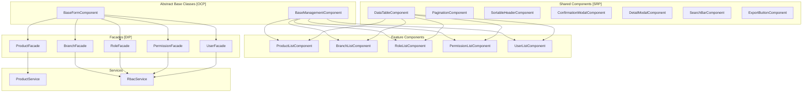

# Management System Comprehensive Fix Plan

## Executive Summary

This document outlines a comprehensive plan to fix and enhance the Product, Staff, Roles, Branches, and Permissions management modules. The plan addresses the 500 Internal Server Error issues, implements proper search/pagination/sorting/export functionality, and applies SOLID principles for reusable components.

## Current Issues Analysis

### 1. API 500 Errors
**Problem**: Endpoints `/api/v1/rbac/roles/all` and `/api/v1/rbac/branches/all` return 500 errors

**Root Cause**: Based on the OpenAPI spec analysis:
- The `/rbac/roles/all` endpoint does NOT exist in the API specification
- The `/rbac/branches/all` endpoint does NOT exist in the API specification
- Available endpoints are:
  - `GET /rbac/roles` - Returns paginated roles
  - `GET /rbac/branches` - Returns paginated branches
  - `GET /rbac/permissions` - Returns paginated permissions

**Impact**: User-list component fails to load filter data for branches and roles

### 2. Inconsistent Implementation Patterns

| Feature | Product | Branch | Role | Permission | User |
|---------|---------|--------|------|------------|------|
| Search | Client-side only | Server-side | Server-side | Server-side | Server-side |
| Pagination | Client-side | Server-side | Server-side | Server-side | Server-side |
| Sorting | Client-side | Server-side | Server-side | Server-side | Server-side |
| Export | CSV | Missing | CSV | CSV | CSV |
| Detail Page | Yes | Modal only | Modal only | No | Modal only |
| Form Page | Separate | Separate | Separate | Modal | Missing |

### 3. Code Duplication
- Similar table structures repeated across components
- Duplicate pagination logic
- Duplicate search debounce logic
- Duplicate export CSV logic
- Duplicate modal handling

## Proposed Architecture

### SOLID Principles Application



### 1. Single Responsibility Principle (SRP)
- **DataTableComponent**: Handles table rendering only
- **PaginationComponent**: Handles pagination controls only
- **SearchBarComponent**: Handles search input with debounce
- **ExportButtonComponent**: Handles export functionality
- **Facades**: Each facade manages state for one feature

### 2. Open/Closed Principle (OCP)
- **BaseManagementComponent**: Abstract class for list views
- **BaseFormComponent**: Abstract class for form views
- Features extend base classes without modifying them

### 3. Liskov Substitution Principle (LSP)
- All list components can be used interchangeably
- All form components follow same interface

### 4. Interface Segregation Principle (ISP)
- Separate interfaces for ListConfig, FormConfig, TableColumn
- No component depends on methods it doesn't use

### 5. Dependency Inversion Principle (DIP)
- Components depend on Facade abstractions
- Facades depend on Service abstractions

## Detailed Implementation Plan

### Phase 1: Fix API Integration (Critical)

#### 1.1 Fix RbacService Endpoints
```typescript
// Remove non-existent endpoints
// BEFORE:
getAllBranches(): Observable<Branch[]> {
  return this.http.get<ApiResponse<Branch[]>>(`${this.baseUrl}/rbac/branches/all`)
}

getAllRoles(): Observable<Role[]> {
  return this.http.get<ApiResponse<Role[]>>(`${this.baseUrl}/rbac/roles/all`)
}

// AFTER:
getAllBranches(): Observable<Branch[]> {
  return this.http.get<ApiResponse<PaginatedResponse<Branch>>>(`${this.baseUrl}/rbac/branches`, { params: { pageSize: 1000 } })
    .pipe(map(res => res.data.items))
}

getAllRoles(): Observable<Role[]> {
  return this.http.get<ApiResponse<PaginatedResponse<Role>>>(`${this.baseUrl}/rbac/roles`, { params: { pageSize: 1000 } })
    .pipe(map(res => res.data.items))
}
```

#### 1.2 Fix User-List Filter Loading
```typescript
// In user-list.component.ts
loadFilters() {
  // Use paginated endpoints with large pageSize instead of /all
  forkJoin({
    branches: this.rbacService.getBranches({ pageSize: 1000 }).pipe(map(r => r.items)),
    roles: this.rbacService.getRoles({ pageSize: 1000 }).pipe(map(r => r.items))
  }).subscribe({
    next: (data) => {
      this.branches.set(data.branches);
      this.roles.set(data.roles);
    },
    error: () => {
      this.toastService.show('Failed to load filter data', 'error');
    }
  });
}
```

### Phase 2: Create Reusable Components

#### 2.1 DataTable Component
```typescript
// shared/components/data-table/data-table.component.ts
export interface TableColumn<T> {
  field: keyof T | string;
  header: string;
  sortable?: boolean;
  type?: 'text' | 'badge' | 'actions' | 'custom';
  template?: TemplateRef<any>;
  width?: string;
}

export interface DataTableConfig<T> {
  columns: TableColumn<T>[];
  data: T[];
  loading: boolean;
  emptyMessage: string;
  sortField: string;
  sortDirection: 'asc' | 'desc';
}

@Component({
  selector: 'app-data-table',
  template: `
    <table class="data-table">
      <thead>
        <tr>
          <th *ngFor="let col of config.columns" 
              [style.width]="col.width"
              [class.sortable]="col.sortable"
              (click)="col.sortable && onSort(col.field)">
            {{ col.header }}
            <i *ngIf="col.sortable" class="pi" [class.pi-sort]="..."></i>
          </th>
        </tr>
      </thead>
      <tbody>
        <!-- Loading, Empty, Data rows -->
      </tbody>
    </table>
  `
})
```

#### 2.2 SearchBar Component
```typescript
// shared/components/search-bar/search-bar.component.ts
@Component({
  selector: 'app-search-bar',
  template: `
    <div class="relative">
      <i class="pi pi-search absolute left-3 top-1/2 -translate-y-1/2"></i>
      <input 
        type="text" 
        [placeholder]="placeholder"
        [value]="value()"
        (input)="onInput($event)"
        class="form-input pl-10 w-full" />
    </div>
  `
})
export class SearchBarComponent {
  value = signal('');
  @Input() placeholder = 'Search...';
  @Output() search = new EventEmitter<string>();
  
  private searchSubject = new Subject<string>();
  
  constructor() {
    this.searchSubject.pipe(
      debounceTime(300),
      distinctUntilChanged(),
      takeUntilDestroyed()
    ).subscribe(query => this.search.emit(query));
  }
}
```

#### 2.3 ExportButton Component
```typescript
// shared/components/export-button/export-button.component.ts
@Component({
  selector: 'app-export-button',
  template: `
    <button 
      (click)="onExport()"
      [disabled]="isExporting() || disabled"
      class="btn-secondary">
      <i class="pi pi-download" [class.pi-spin]="isExporting()"></i>
      <span *ngIf="!iconOnly">Export</span>
    </button>
  `
})
export class ExportButtonComponent {
  @Input() data: any[] = [];
  @Input() filename = 'export';
  @Input() disabled = false;
  @Input() iconOnly = false;
  @Input() columns: ExportColumn[] = [];
  
  isExporting = signal(false);
  
  onExport() {
    this.isExporting.set(true);
    // Export logic
    this.isExporting.set(false);
  }
}
```

### Phase 3: Create Base Classes

#### 3.1 BaseManagementComponent
```typescript
// shared/base/base-management.component.ts
export abstract class BaseManagementComponent<T, F = any> implements OnInit {
  // State signals
  items = signal<T[]>([]);
  loading = signal(false);
  error = signal<string | null>(null);
  
  // Pagination
  currentPage = signal(1);
  pageSize = signal(10);
  totalItems = signal(0);
  totalPages = signal(1);
  
  // Sorting
  sortField = signal('id');
  sortDirection = signal<'asc' | 'desc'>('asc');
  
  // Search
  searchQuery = signal('');
  
  // Filters
  filters = signal<F>({} as F);
  
  abstract loadItems(): void;
  abstract getExportData(): Observable<T[]>;
  abstract getTableColumns(): TableColumn<T>[];
  
  onSearch(query: string) {
    this.searchQuery.set(query);
    this.currentPage.set(1);
    this.loadItems();
  }
  
  onPageChange(page: number) {
    this.currentPage.set(page);
    this.loadItems();
  }
  
  onSort(sortConfig: SortConfig) {
    this.sortField.set(sortConfig.field);
    this.sortDirection.set(sortConfig.direction);
    this.loadItems();
  }
}
```

### Phase 4: Update Feature Components

#### 4.1 Product Module Updates
- Add server-side pagination support to ProductService
- Create ProductFacade for state management
- Update ProductListComponent to use DataTableComponent
- Add ProductDetailComponent for detail view

#### 4.2 Branch Module Updates
- Update BranchListComponent to use reusable components
- Add BranchDetailComponent (separate page)
- Add export functionality

#### 4.3 Role Module Updates
- Convert inline template to separate HTML file
- Add RoleDetailComponent (separate page)
- Update to use reusable components

#### 4.4 Permission Module Updates
- Convert inline template to separate HTML file
- Add PermissionDetailComponent (separate page)
- Update to use reusable components

#### 4.5 User Module Updates
- Create UserFormComponent for create/edit
- Create UserDetailComponent for detail view
- Update UserListComponent to use reusable components
- Add proper role assignment UI

### Phase 5: Route Configuration Updates

```typescript
// products.routes.ts
export const PRODUCT_ROUTES: Routes = [
  { path: '', component: ProductListComponent },
  { path: 'new', component: ProductFormComponent },
  { path: ':id', component: ProductDetailComponent },
  { path: ':id/edit', component: ProductFormComponent }
];

// branches.routes.ts
export const BRANCH_ROUTES: Routes = [
  { path: '', component: BranchListComponent },
  { path: 'new', component: BranchFormComponent },
  { path: ':id', component: BranchDetailComponent },  // NEW
  { path: ':id/edit', component: BranchFormComponent }
];

// roles.routes.ts
export const ROLE_ROUTES: Routes = [
  { path: '', component: RoleListComponent },
  { path: 'new', component: RoleFormComponent },
  { path: ':id', component: RoleDetailComponent },  // NEW
  { path: ':id/edit', component: RoleFormComponent },
  { path: 'permissions', component: PermissionListComponent }
];

// permissions.routes.ts (NEW)
export const PERMISSION_ROUTES: Routes = [
  { path: '', component: PermissionListComponent },
  { path: 'new', component: PermissionFormComponent },
  { path: ':id', component: PermissionDetailComponent },
  { path: ':id/edit', component: PermissionFormComponent }
];

// users.routes.ts (NEW or update existing)
export const USER_ROUTES: Routes = [
  { path: '', component: UserListComponent },
  { path: 'new', component: UserFormComponent },
  { path: ':id', component: UserDetailComponent },
  { path: ':id/edit', component: UserFormComponent }
];
```

## File Structure

```
src/app/
├── core/
│   └── services/
│       └── rbac.service.ts (fix endpoints)
├── shared/
│   ├── components/
│   │   ├── data-table/
│   │   │   ├── data-table.component.ts
│   │   │   └── data-table.component.html
│   │   ├── search-bar/
│   │   │   └── search-bar.component.ts
│   │   └── export-button/
│   │       └── export-button.component.ts
│   └── base/
│       └── base-management.component.ts
├── features/
│   ├── products/
│   │   ├── pages/
│   │   │   ├── product-list/
│   │   │   ├── product-form/
│   │   │   └── product-detail/
│   │   └── facades/
│   │       └── product.facade.ts
│   ├── branches/
│   │   ├── pages/
│   │   │   ├── branch-list/
│   │   │   ├── branch-form/
│   │   │   └── branch-detail/ (NEW)
│   │   └── facades/
│   │       └── branch.facade.ts (NEW)
│   ├── roles/
│   │   ├── pages/
│   │   │   ├── role-list/
│   │   │   │   ├── role-list.component.ts
│   │   │   │   └── role-list.component.html (NEW - separate file)
│   │   │   ├── role-form/
│   │   │   └── role-detail/ (NEW)
│   │   ├── pages/
│   │   │   └── permission-list/
│   │   │       ├── permission-list.component.ts
│   │   │       └── permission-list.component.html (NEW)
│   │   └── facades/
│   │       ├── role.facade.ts (NEW)
│   │       └── permission.facade.ts (NEW)
│   └── users/
│       ├── pages/
│       │   ├── user-list/
│       │   ├── user-form/ (NEW)
│       │   └── user-detail/ (NEW)
│       └── facades/
│           └── user.facade.ts (NEW)
```

## Implementation Checklist

### Critical Fixes (Phase 1)
- [ ] Fix `getAllBranches()` endpoint in RbacService
- [ ] Fix `getAllRoles()` endpoint in RbacService
- [ ] Fix `getAllPermissions()` endpoint in RbacService
- [ ] Update UserListComponent to use paginated endpoints for filters
- [ ] Test API connectivity

### Reusable Components (Phase 2)
- [ ] Create DataTableComponent
- [ ] Create SearchBarComponent
- [ ] Create ExportButtonComponent
- [ ] Create FilterDropdownComponent
- [ ] Create PageHeaderComponent

### Base Classes (Phase 3)
- [ ] Create BaseManagementComponent
- [ ] Create BaseFormComponent
- [ ] Create BaseDetailComponent

### Feature Updates (Phase 4)
- [ ] Update ProductListComponent with reusable components
- [ ] Update BranchListComponent with reusable components
- [ ] Update RoleListComponent with reusable components
- [ ] Update PermissionListComponent with reusable components
- [ ] Update UserListComponent with reusable components

### New Components (Phase 5)
- [ ] Create BranchDetailComponent
- [ ] Create RoleDetailComponent
- [ ] Create PermissionDetailComponent
- [ ] Create PermissionFormComponent
- [ ] Create UserFormComponent
- [ ] Create UserDetailComponent

### Facades (Phase 6)
- [ ] Create ProductFacade
- [ ] Create BranchFacade
- [ ] Create RoleFacade
- [ ] Create PermissionFacade
- [ ] Create UserFacade

### Testing (Phase 7)
- [ ] Unit tests for reusable components
- [ ] Unit tests for facades
- [ ] Integration tests for feature components
- [ ] E2E tests for critical user flows

## API Endpoint Mapping

| Feature | List | Get By ID | Create | Update | Delete |
|---------|------|-----------|--------|--------|--------|
| Products | GET /products | GET /products/{id} | POST /products | PUT /products/{id} | DELETE /products/{id} |
| Branches | GET /rbac/branches | GET /rbac/branches/{id} | POST /rbac/branches | PUT /rbac/branches/{id} | DELETE /rbac/branches/{id} |
| Roles | GET /rbac/roles | GET /rbac/roles/{id} | POST /rbac/roles | PUT /rbac/roles/{id} | DELETE /rbac/roles/{id} |
| Permissions | GET /rbac/permissions | N/A | POST /rbac/permissions | PUT /rbac/permissions/{id} | DELETE /rbac/permissions/{id} |
| Users | GET /users | GET /users/{id} | POST /users | PUT /users/{id} | DELETE /users/admin/users/{id} |

## Notes

1. **API Limitation**: The `/all` endpoints don't exist. Use paginated endpoints with large pageSize (1000) for filter dropdowns.

2. **Role-Based Access**: According to the API spec, the following roles have access:
   - Marketing
   - Back Office
   - Branch Manager
   - Admin

3. **Export Format**: All exports should use CSV format with proper escaping for special characters.

4. **Error Handling**: Use the existing error.interceptor.ts for global error handling.

5. **Loading States**: All async operations should show loading indicators.

6. **Confirmation Dialogs**: All delete operations must show confirmation dialogs.
