# Management System Enhancement Plan

## Overview
Pengembangan fitur manajemen lengkap untuk Branch, Staff & Roles, Product, dan Permission dengan fitur search, create, edit, detail, delete dengan konfirmasi, download data, pagination, dan sorting.

## Arsitektur dan Alur Data

```mermaid
flowchart TB
    subgraph "Shared Components"
        PAGINATION[Pagination Component]
        SORTABLE[Sortable Table Header]
        CONFIRM[Confirm Delete Modal]
        DETAIL[Detail Card Modal]
    end

    subgraph "Branch Management"
        BL[Branch List]
        BC[Create/Edit Branch Modal]
        BD[Branch Detail Card]
        BS[Branch Staff View]
        BL --> BC
        BL --> BD
        BL --> BS
    end

    subgraph "Staff & Roles"
        UL[User List]
        UC[Create/Edit User Page]
        UD[User Detail Card]
        UL --> UC
        UL --> UD
    end

    subgraph "Product Management"
        PL[Product List]
        PC[Create Product Page]
        PE[Edit Product Page]
        PD[Product Detail Card]
        PL --> PC
        PL --> PE
        PL --> PD
    end

    subgraph "Permission Management"
        PML[Permission List]
        PMC[Create/Edit Permission Modal]
        PML --> PMC
    end

    subgraph "Role Management"
        RL[Role List]
        RC[Create/Edit Role Modal]
        RD[Role Detail Card]
        RL --> RC
        RL --> RD
    end

    PAGINATION --> BL
    PAGINATION --> UL
    PAGINATION --> PL
    PAGINATION --> PML
    PAGINATION --> RL

    SORTABLE --> BL
    SORTABLE --> UL
    SORTABLE --> PL
    SORTABLE --> PML
    SORTABLE --> RL

    CONFIRM --> BL
    CONFIRM --> UL
    CONFIRM --> PL
    CONFIRM --> PML
    CONFIRM --> RL

    DETAIL --> BL
    DETAIL --> UL
    DETAIL --> PL
    DETAIL --> RL
```



## Struktur Data

### Branch dengan Staff
```typescript
interface BranchWithStaff extends Branch {
  staff: User[];
  branchManager?: User;
  marketingStaff: User[];
}
```

### Pagination Response
```typescript
interface PaginatedResponse<T> {
  items: T[];
  total: number;
  page: number;
  pageSize: number;
  totalPages: number;
}
```

### Sort Config
```typescript
interface SortConfig {
  field: string;
  direction: 'asc' | 'desc';
}
```

## Phase 1: Branch Management Enhancement

### 1.1 Branch List Enhancement
**File:** `src/app/features/branches/pages/branch-list.component.ts`

**Fitur yang ditambahkan:**
- Pagination dengan state: `currentPage`, `pageSize`, `totalItems`
- Sorting dengan state: `sortField`, `sortDirection`
- Search dengan debounce
- Filter staff per branch (BM & Marketing)

**State Management:**
```typescript
// Pagination
pagination = signal({
  page: 1,
  pageSize: 10,
  total: 0
});

// Sorting
sortConfig = signal<SortConfig>({
  field: 'name',
  direction: 'asc'
});

// Search
searchQuery = signal('');
searchDebounced = toSignal(toObservable(searchQuery).pipe(debounceTime(300)));

// Filter staff
selectedBranchForStaff = signal<Branch | null>(null);
staffFilterRole = signal<'ALL' | 'BRANCH_MANAGER' | 'MARKETING'>('ALL');
```

### 1.2 Branch Detail Modal (Card View)
**Komponen:** Detail card modal dengan informasi:
- Branch info (nama, alamat, kontak)
- Peta lokasi (jika ada koordinat)
- Statistik staff (total, BM count, Marketing count)
- List staff (dengan filter role)

### 1.3 Assign Staff ke Branch
**Fitur:**
- Modal untuk assign user ke branch
- Dropdown/select user (filter yang belum punya branch atau bisa pindah)
- Role assignment (BM atau Marketing)
- Validasi: 1 branch hanya boleh 1 BM

### 1.4 Confirm Delete Modal
**Komponen:** Reusable confirm delete modal
- Pesan konfirmasi dengan nama item
- Tombol Cancel dan Confirm
- Loading state saat proses delete

## Phase 2: Staff & Roles Enhancement

### 2.1 User List Enhancement
**File:** `src/app/features/users/pages/user-list.component.ts`

**Fitur yang ditambahkan:**
- Pagination
- Sorting (by name, email, role, branch)
- Search (fullName, email, username)
- Filter by role
- Filter by branch

### 2.2 Create/Edit User Page
**File Baru:** 
- `src/app/features/users/pages/user-form/user-form.component.ts`
- `src/app/features/users/pages/user-form/user-form.component.html`

**Route:** `/users/new` dan `/users/:id/edit`

**Form Fields:**
- fullName (required)
- username (required)
- email (required, email format)
- phone (optional)
- roleIds (multi-select)
- branchId (select, optional)
- status (Active/Inactive)

### 2.3 User Detail Card Modal
**Informasi yang ditampilkan:**
- Avatar dengan inisial
- Informasi personal (nama, email, phone)
- Role badges
- Branch info (jika ada)
- Status badge
- Tanggal dibuat/terakhir update (jika ada)

## Phase 3: Product Management Enhancement

### 3.1 Product List Enhancement
**File:** `src/app/features/products/product-list/product-list.component.ts`

**Fitur yang ditambahkan:**
- Pagination
- Sorting
- Search
- Filter by status

### 3.2 Create Product Page
**File Baru:**
- `src/app/features/products/product-form/product-form.component.ts`
- `src/app/features/products/product-form/product-form.component.html`

**Route:** `/products/new`

**Form Fields:**
- code (required, unique)
- name (required)
- description (optional)
- minAmount (required, number)
- maxAmount (required, number)
- minTenor (required, number)
- maxTenor (required, number)
- interestRate (required, number)
- adminFee (required, number)
- isActive (boolean)

### 3.3 Edit Product Page
**Route:** `/products/:id/edit`

### 3.4 Product Detail Card Modal
**Informasi yang ditampilkan:**
- Product name & code
- Amount range
- Tenor range
- Interest rate
- Admin fee
- Status badge
- Description (jika ada)

## Phase 4: Permission Management Enhancement

### 4.1 Permission List Enhancement
**File:** `src/app/features/roles/pages/permission-list.component.ts`

**Fitur yang ditambahkan:**
- Pagination
- Sorting
- Search
- Export CSV
- Confirm delete modal

## Phase 5: Role Management Enhancement

### 5.1 Role List Enhancement
**File:** `src/app/features/roles/pages/role-list.component.ts`

**Fitur yang ditambahkan:**
- Pagination
- Sorting
- Search
- Export CSV
- Detail modal dengan permission list
- Confirm delete modal

## Phase 6: Shared Components

### 6.1 Pagination Component
**File:** `src/app/shared/components/pagination/pagination.component.ts`

**Props:**
- currentPage: number
- pageSize: number
- totalItems: number
- pageSizeOptions: number[]

**Events:**
- pageChange: EventEmitter<number>
- pageSizeChange: EventEmitter<number>

### 6.2 Sortable Table Header Component
**File:** `src/app/shared/components/sortable-header/sortable-header.component.ts`

**Props:**
- field: string
- label: string
- sortField: string
- sortDirection: 'asc' | 'desc'

**Events:**
- sort: EventEmitter<SortConfig>

### 6.3 Confirm Delete Modal Component
**File:** `src/app/shared/components/confirm-modal/confirm-modal.component.ts`

**Props:**
- title: string
- message: string
- itemName: string
- isOpen: boolean

**Events:**
- confirm: EventEmitter<void>
- cancel: EventEmitter<void>

### 6.4 Detail Card Modal Component
**File:** `src/app/shared/components/detail-modal/detail-modal.component.ts`

**Template:** Slot-based untuk konten yang fleksibel

**Props:**
- title: string
- isOpen: boolean

**Events:**
- close: EventEmitter<void>

## API Integration

### Backend Endpoints (asumsi)
```
GET    /api/rbac/branches?page=&pageSize=&sort=&search=
GET    /api/rbac/branches/:id/staff
POST   /api/rbac/branches/:id/assign-staff
DELETE /api/rbac/branches/:id/remove-staff/:userId

GET    /api/users?page=&pageSize=&sort=&search=&role=&branch=
POST   /api/users
PUT    /api/users/:id

GET    /api/products?page=&pageSize=&sort=&search=&status=
POST   /api/products
PUT    /api/products/:id

GET    /api/rbac/permissions?page=&pageSize=&sort=&search=
GET    /api/rbac/roles?page=&pageSize=&sort=&search=
```

## Styling Guidelines

### Consistent Design System
- Gunakan class yang sudah ada: `btn-primary`, `btn-secondary`, `card`, `table-card`, dll
- Warna: brand-main, text-primary, text-secondary, bg-surface, bg-muted
- Border radius: rounded-lg, rounded-xl
- Shadows: shadow-sm, shadow-md

### Responsive Breakpoints
- Mobile: < 640px
- Tablet: 640px - 1024px
- Desktop: > 1024px

## Testing Checklist

### Functionality
- [ ] Pagination works correctly
- [ ] Sorting works on all columns
- [ ] Search filters data correctly
- [ ] Create/Edit forms validate correctly
- [ ] Delete confirmation prevents accidental deletion
- [ ] Export CSV downloads correct data
- [ ] Detail modals show correct information

### RBAC
- [ ] BM only sees staff from their branch
- [ ] Admin sees all data
- [ ] Marketing only sees their own data (if applicable)

### UX
- [ ] Loading states shown during async operations
- [ ] Error messages are user-friendly
- [ ] Success toasts appear after operations
- [ ] Forms have proper validation feedback
