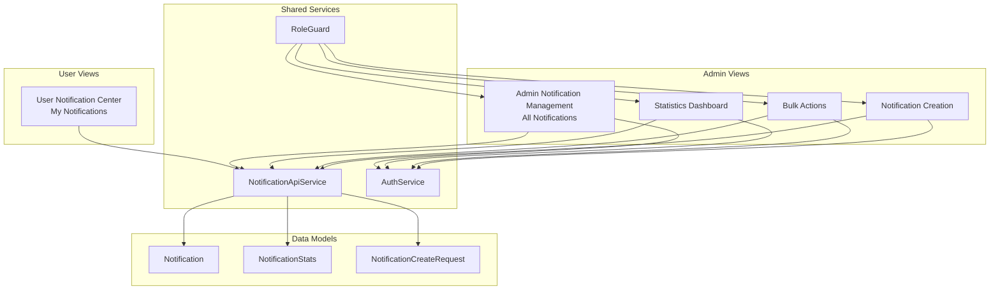
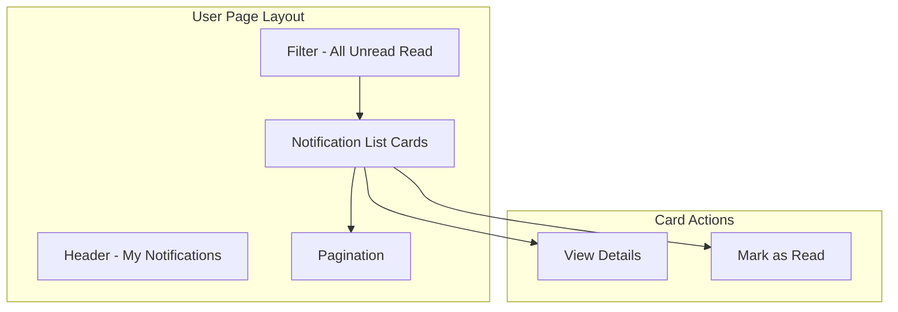
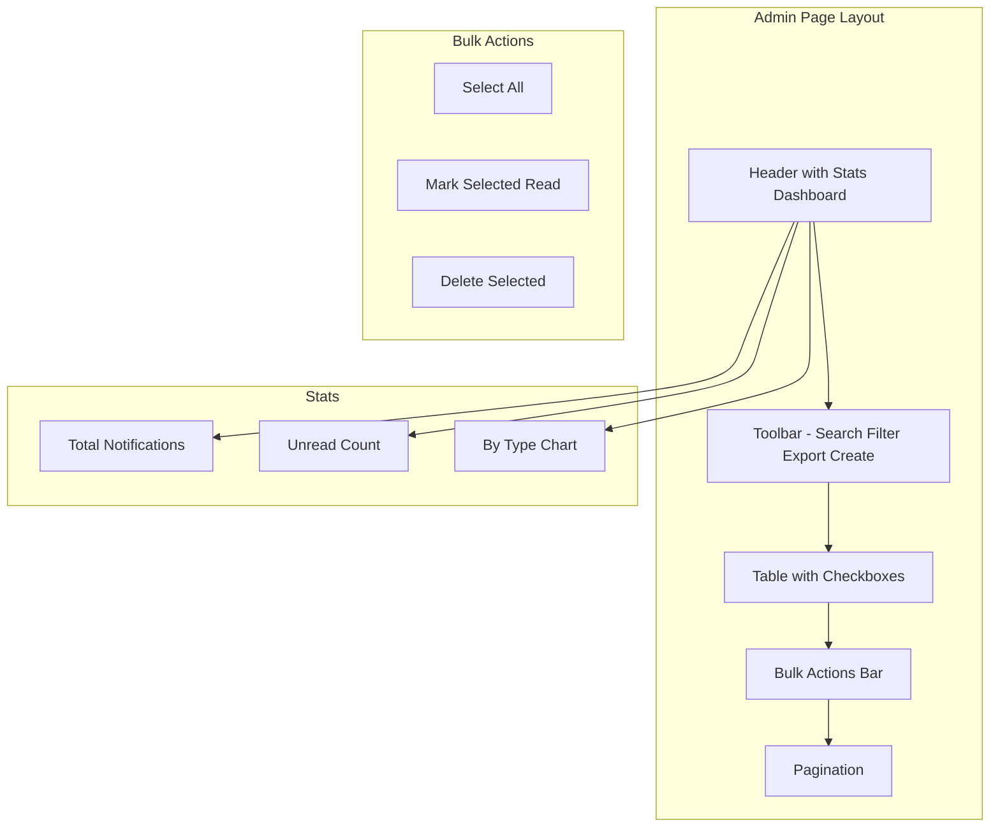
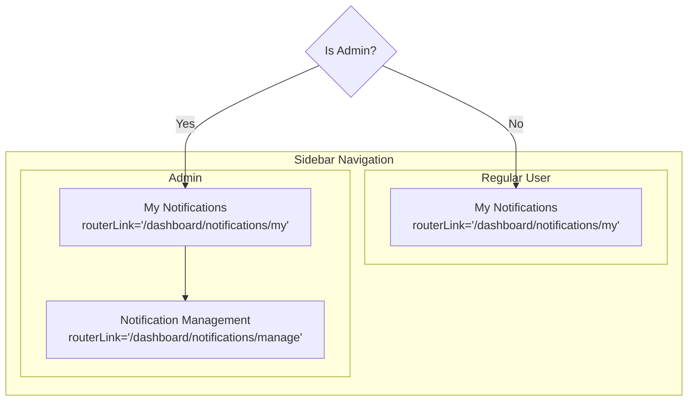

# Notification System - Role-Based Management Plan

## Overview
This plan outlines the implementation of a dual-view notification system:
1. **User Notification Center** (`/dashboard/notifications/my`) - For regular users
2. **Admin Notification Management** (`/dashboard/notifications/manage`) - For administrators

## Architecture Diagram



## Current State Analysis

### Existing Components
- [`Notification`](src/app/core/models/notification.models.ts:3) model with basic fields
- [`NotificationApiService`](src/app/core/services/notification-api.service.ts:11) with user and admin endpoints
- [`NotificationFacade`](src/app/features/notifications/facades/notification.facade.ts:11) for state management
- [`NotificationListComponent`](src/app/features/notifications/pages/notification-list.component.ts:31) - existing admin-style page

### Routes Configuration
- [`app.routes.ts`](src/app/app.routes.ts:62) - `/dashboard/notifications` route exists
- [`sidebar.component.ts`](src/app/core/layouts/sidebar/sidebar.component.ts:44) - `isAdmin()` method checks for ROLE_ADMIN or ROLE_SUPER_ADMIN

## Implementation Plan

### Phase 1: Data Models & API Extensions

#### 1.1 Update Notification Models
**File:** [`src/app/core/models/notification.models.ts`](src/app/core/models/notification.models.ts)

Add new models:
```typescript
// Notification Statistics
export interface NotificationStats {
    total: number;
    unread: number;
    byType: Record<NotificationType, number>;
    byDate: { date: string; count: number }[];
}

// Create Notification Request (Admin only)
export interface NotificationCreateRequest {
    userId?: string; // Optional - if empty, broadcast to all
    title: string;
    body: string;
    type: NotificationType;
    referenceId?: string;
    link?: string;
}

// Bulk Action Request (Admin only)
export interface BulkActionRequest {
    notificationIds: string[];
    action: 'mark_read' | 'delete';
}
```

#### 1.2 Extend NotificationApiService
**File:** [`src/app/core/services/notification-api.service.ts`](src/app/core/services/notification-api.service.ts:11)

Add admin endpoints:
```typescript
// Get notification statistics (Admin only)
getNotificationStats(): Observable<NotificationStats>;

// Create notification (Admin only)
createNotification(request: NotificationCreateRequest): Observable<Notification>;

// Bulk mark as read (Admin only)
bulkMarkAsRead(ids: string[]): Observable<void>;

// Bulk delete (Admin only)
bulkDelete(ids: string[]): Observable<void>;

// Get notifications by user (Admin only)
getNotificationsByUser(userId: string, page: number, pageSize: number): Observable<NotificationListResponse>;
```

### Phase 2: Facade Separation

#### 2.1 User Notification Facade
**File:** [`src/app/features/notifications/facades/user-notification.facade.ts`](src/app/features/notifications/facades/user-notification.facade.ts)

New file for user-specific notification operations:
- Load user's personal notifications
- Mark as read
- Mark all as read
- Simple list view state

#### 2.2 Admin Notification Facade
**File:** [`src/app/features/notifications/facades/admin-notification.facade.ts`](src/app/features/notifications/facades/admin-notification.facade.ts)

New file for admin-specific operations:
- All existing facade methods
- Statistics loading
- Bulk operations
- Notification creation
- User-based filtering

### Phase 3: User Notification Center

#### 3.1 User Page Component
**File:** [`src/app/features/notifications/pages/my-notifications/my-notifications.component.ts`](src/app/features/notifications/pages/my-notifications/my-notifications.component.ts)

Features:
- Card-based layout (more personal)
- Group by date
- Quick actions (mark as read, view details)
- Simple pagination
- Unread count badge

#### 3.2 User Page Template
**File:** [`src/app/features/notifications/pages/my-notifications/my-notifications.component.html`](src/app/features/notifications/pages/my-notifications/my-notifications.component.html)



### Phase 4: Admin Notification Management

#### 4.1 Admin Page Component
**File:** [`src/app/features/notifications/pages/notification-manage/notification-manage.component.ts`](src/app/features/notifications/pages/notification-manage/notification-manage.component.ts)

Features:
- Table-based layout (management style)
- Statistics dashboard at top
- Bulk selection and actions
- Filter by user
- Advanced search
- Export functionality
- Create notification modal

#### 4.2 Admin Page Template
**File:** [`src/app/features/notifications/pages/notification-manage/notification-manage.component.html`](src/app/features/notifications/pages/notification-manage/notification-manage.component.html)



### Phase 5: Routes & Navigation

#### 5.1 Updated Routes Configuration
**File:** [`src/app/features/notifications/notifications.routes.ts`](src/app/features/notifications/notifications.routes.ts)

```typescript
export const NOTIFICATION_ROUTES: Routes = [
    {
        // User's personal notifications - accessible by all authenticated users
        path: 'my',
        loadComponent: () => import('./pages/my-notifications/my-notifications.component')
            .then(m => m.MyNotificationsComponent)
    },
    {
        // Admin notification management - accessible by admins only
        path: 'manage',
        loadComponent: () => import('./pages/notification-manage/notification-manage.component')
            .then(m => m.NotificationManageComponent),
        canActivate: [roleGuard],
        data: { roles: ['ROLE_ADMIN', 'ROLE_SUPER_ADMIN'] }
    },
    {
        // Redirect old path to user notifications
        path: '',
        redirectTo: 'my',
        pathMatch: 'full'
    },
    {
        // Detail view
        path: ':id',
        loadComponent: () => import('./pages/notification-detail/notification-detail.component')
            .then(m => m.NotificationDetailComponent)
    }
];
```

#### 5.2 Updated Sidebar Navigation
**File:** [`src/app/core/layouts/sidebar/sidebar.component.html`](src/app/core/layouts/sidebar/sidebar.component.html)



### Phase 6: Permission Guard

#### 6.1 Role Guard Enhancement
**File:** [`src/app/core/guards/role.guard.ts`](src/app/core/guards/role.guard.ts)

Ensure admin routes are properly protected with role-based access.

## File Structure

```
src/app/features/notifications/
├── notifications.routes.ts                    # Updated routes
├── facades/
│   ├── notification.facade.ts                  # Keep existing facade
│   ├── user-notification.facade.ts             # NEW: User-specific facade
│   └── admin-notification.facade.ts            # NEW: Admin-specific facade
├── pages/
│   ├── my-notifications/                       # NEW: User notification center
│   │   ├── my-notifications.component.ts
│   │   └── my-notifications.component.html
│   ├── notification-manage/                     # NEW: Admin management page
│   │   ├── notification-manage.component.ts
│   │   └── notification-manage.component.html
│   ├── notification-list.component.ts          # Existing (refactor as needed)
│   ├── notification-list.component.html
│   └── notification-detail/
│       ├── notification-detail.component.ts
│       └── notification-detail.component.html
└── components/
    ├── notification-card/                      # NEW: Card component for users
    ├── notification-stats/                      # NEW: Stats dashboard
    ├── bulk-actions-bar/                       # NEW: Bulk actions component
    └── create-notification-modal/              # NEW: Create notification modal
```

## Feature Comparison

| Feature | User View | Admin View |
|---------|-----------|------------|
| View own notifications | ✅ | ✅ (all users) |
| Mark as read | ✅ | ✅ |
| Mark all as read | ✅ | ✅ |
| Delete notification | ❌ | ✅ |
| Bulk actions | ❌ | ✅ |
| Statistics dashboard | ❌ | ✅ |
| Filter by user | ❌ | ✅ |
| Create notification | ❌ | ✅ |
| Export to CSV | ❌ | ✅ |
| Search all fields | Basic | Advanced |

## Implementation Order

1. Update data models
2. Extend NotificationApiService
3. Create user notification facade
4. Create admin notification facade
5. Create user notification page (My Notifications)
6. Create admin notification page (Notification Management)
7. Update routes with role guards
8. Update sidebar navigation
9. Add shared components (stats, bulk actions)
10. Test and validate

## Migration Strategy

1. Keep existing [`NotificationListComponent`](src/app/features/notifications/pages/notification-list.component.ts:31) as reference
2. Create new components alongside existing ones
3. Update routes to point to new components
4. Remove/refactor old components after successful migration
5. Update sidebar links based on user role
