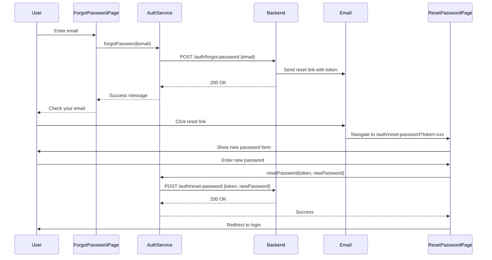

# Reset Password Flow Implementation Plan

## Overview
This plan outlines the implementation of a reset password flow for users who have forgotten their password. This is different from the existing "change password" functionality which requires users to be logged in and know their current password.

## Current State
- **Forgot Password**: [`ForgotPasswordComponent`](src/app/features/auth/forgot-password/forgot-password.component.ts) - Sends reset link to user's email
- **Change Password**: [`ChangePasswordComponent`](src/app/features/profile/change-password.component.ts) - Requires authentication and current password
- **AuthService**: Has [`forgotPassword()`](src/app/core/services/auth.service.ts:99-101) and [`changePassword()`](src/app/core/services/auth.service.ts:103-105) methods

## Reset Password Flow



## Implementation Tasks

### 1. Add resetPassword Method to AuthService
**File**: [`src/app/core/services/auth.service.ts`](src/app/core/services/auth.service.ts)

Add a new method to handle password reset with token:

```typescript
resetPassword(token: string, newPassword: string): Observable<ApiResponse<Object>> {
    return this.http.post<ApiResponse<Object>>(`${this.baseUrl}/reset-password`, { 
        token, 
        newPassword 
    });
}
```

### 2. Create ResetPasswordComponent
**File**: `src/app/features/auth/reset-password/reset-password.component.ts`

Create a new component with:
- Form fields: `newPassword`, `confirmPassword`
- Token extraction from URL query parameters
- Validation: required, minimum length (8 characters), password matching
- Loading state
- Success/error handling with toast notifications
- Redirect to login on success

**Template**: `src/app/features/auth/reset-password/reset-password.component.html`
**Styles**: `src/app/features/auth/reset-password/reset-password.component.css`

### 3. Update Auth Routes
**File**: [`src/app/features/auth/auth.routes.ts`](src/app/features/auth/auth.routes.ts)

Add route for reset password page:

```typescript
{
    path: 'reset-password',
    loadComponent: () => import('./reset-password/reset-password.component').then(m => m.ResetPasswordComponent)
}
```

### 4. Update Auth Models (Optional)
**File**: [`src/app/features/auth/models/auth.models.ts`](src/app/features/auth/models/auth.models.ts)

Add interfaces for reset password request/response if needed:

```typescript
export interface ResetPasswordRequest {
    token: string;
    newPassword: string;
}
```

## Component Specifications

### ResetPasswordComponent

**Properties**:
- `form: FormGroup` - Reactive form with newPassword and confirmPassword
- `loading: boolean` - Loading state indicator
- `token: string | null` - Reset token from URL query params
- `error: string` - Error message display

**Methods**:
- `ngOnInit()` - Extract token from query params
- `onSubmit()` - Validate form and call AuthService.resetPassword()
- `cancel()` - Navigate back to login

**Form Validation**:
- `newPassword`: required, minLength(8)
- `confirmPassword`: required, must match newPassword

**UI Elements**:
- Header with title and description
- Error message display (if token is missing or invalid)
- Form with password fields
- Submit button with loading state
- Cancel button to return to login
- Link to forgot-password page (if user needs to request new token)

## API Endpoints

### POST /auth/forgot-password
**Request**: `{ "email": "string" }`
**Response**: `{ "success": true, "message": "string", "data": {} }`

### POST /auth/reset-password
**Request**: `{ "token": "string", "newPassword": "string" }`
**Response**: `{ "success": true, "message": "string", "data": {} }`

## User Flow

1. User clicks "Forgot Password?" on login page
2. User enters email address
3. System sends reset link to email
4. User clicks link in email (e.g., `/auth/reset-password?token=abc123`)
5. User enters new password and confirms
6. System validates token and updates password
7. User is redirected to login page with success message

## Error Handling

- **Invalid/Expired Token**: Show error message with link to request new reset link
- **Password Mismatch**: Show inline validation error
- **Password Too Short**: Show inline validation error
- **Network Error**: Show toast notification with error message

## Security Considerations

- Token should be validated on the backend
- Token should have expiration time
- New password should meet minimum requirements
- Token should be single-use (invalidated after use)
